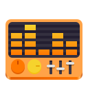
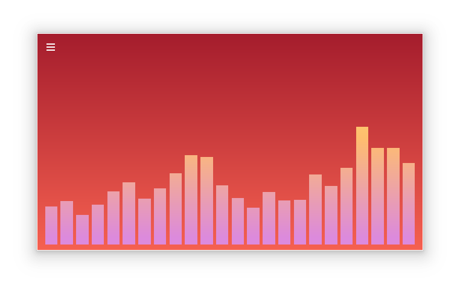
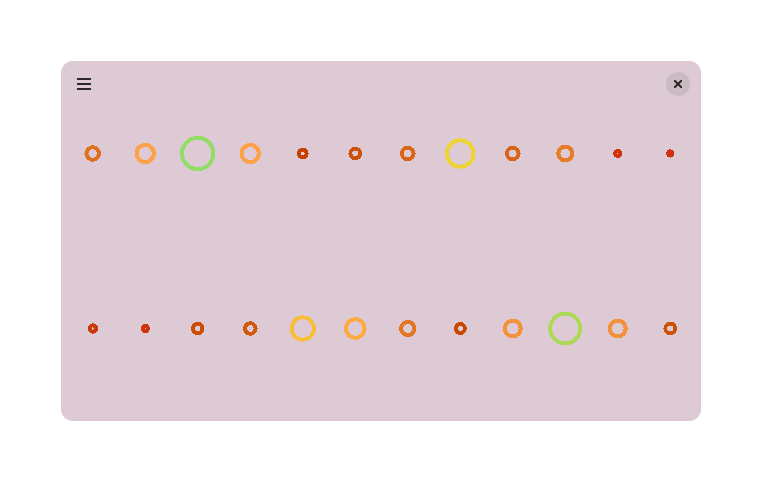
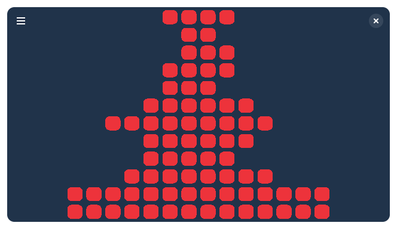

# Cavalier

**Visualize audio with CAVA**

  ✨Powered by [Weblate](https://weblate.org/en/)✨

# Features

* 5 drawing modes!
* Set any single color or a gradient for background and foreground.
* Configure smoothing, noise reduction and a few other CAVA settings.

# Chat

# Contributing

See [CONTRIBUTING.md](CONTRIBUTING.md) for details on how can you help the project and how to provide information so we can help you in case of troubles with the app.

# Screenshots

 
GNOME

 
 
 
 

# Dependencies
- [.NET 7](https://dotnet.microsoft.com/en-us/)
- [CAVA](https://github.com/karlstav/cava/)

# Code of Conduct

This project follows the [GNOME Code of Conduct](https://wiki.gnome.org/Foundation/CodeOfConduct).
